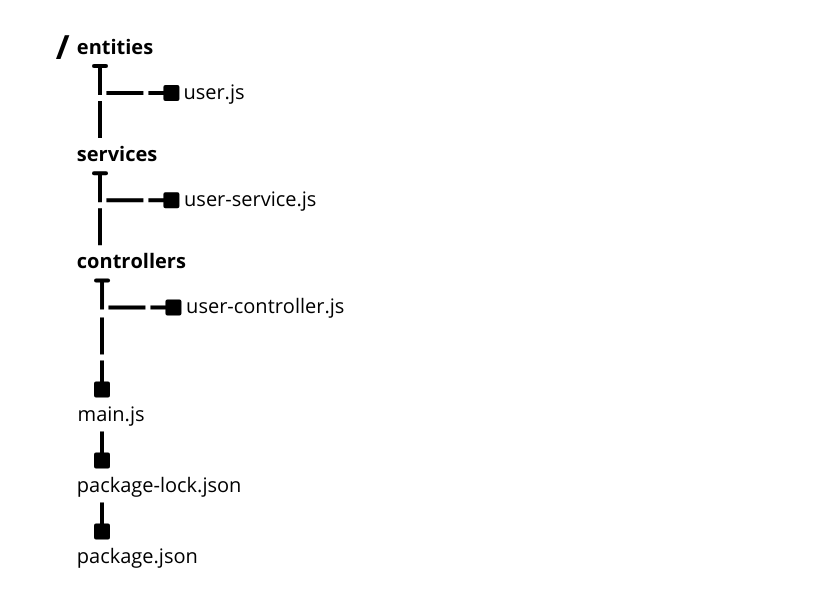

# The Express.js and Sequelize ORM

In the beautiful town of Expressille, there are 2 villages that need each other, village A needs village B and village B needs village A for business purposes between villages. by the way we create a bridge or RESTful API, it is the right solution to connect the two villages.

---

## Chapter 1: How to setup Project

1. You can `cd/your-directory-project` so running this command:

```bash
npm init -y
```

2. **Install the Project Dendencies**

```bash
npm install express sequelize mysql2 nodemon cors dotenv
```

3. **Add like of Highlighting line**:

```json showLineNumbers{6}{8} title="package.json"
{
  "name": "your-project-name",
  "version": "version",
  "description": "your-project-description",
  "main": "main.js",
  "type": "module", // add module type, not using (require)
  "scripts": {
    "dev": "nodemon main.js", // for runnig project using nodemon
    "test": "test"
  }
  "dependencies": {
    "cors": "^version",
    "express": "^version",
    "mysql2": "^version",
    "nodemon": "^version",
    "sequelize": "^version",
    "dotenv": "^version",
  }
}
```

4.  **Structure Directory and File**:



---

## Chapter 2: Fields of MAIN

the main.js file serves to run the project that you have created.

```js showLineNumbers {} title="main.js"
import express from "express";
import "dotenv/config";
import cors from "cors";
import { db } from "./entities/user.js";

const app = express();

app.use(cors({ origin: "domain-frontend-access" }));

// parse requests of content-type - application/json
app.use(express.json());

// parse requests of content-type - application/x-www-form-urlencoded
app.use(express.urlencoded({ extended: true }));

// simple route
app.get("/", (req, res) => {
  res.json({ message: "welcome to alwi code" });
});

// syncronize for creating table to db
db.sequelize
  .sync({ force: true }) // if { force : true } = Drop and re-sync db
  .then(() => {
    console.log("Synced db.");
  })
  .catch((err) => {
    console.log("Failed to sync db: " + err.message);
  });

const PORT = process.env.SERVER_PORT || 5000;
app.listen(PORT, () => {
  console.log(`Server is running on port ${PORT}`);
});
```
